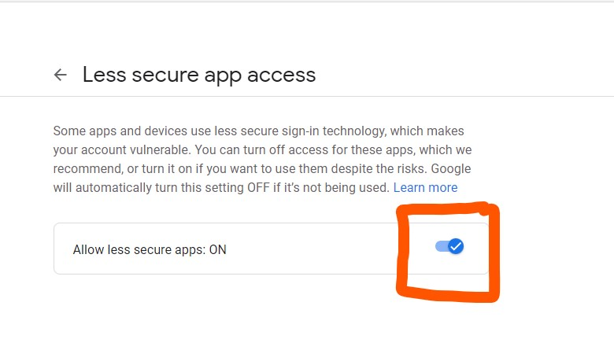

#A simple, yet invisible python script that sends Wi-Fi password to the specified email address.

### - Intro 🙋‍♀️

This script sends Wi-Fi password saved in a local Windows PC to specified email address. You can specify credentials like host, your email, your email provider's hostname, port and password for example smtp.google.com <U>as google mail(G-mail) hostname and 587 as port number </U>. if you want to use your gmail for sending wifi passwords through your gmail account.

### - How to set up script

<b>Disclaimer:</b> You need to have <a href="https://python.org">Python</a> installed on your windows Computer/PC in order to be able to use this script.

<ol>

 In your credentials.txt file enter the following details 

<li> Your Email address ✔</li>
<li> Password of your email/gmail account ✔</li>
<li> Email where you want to send all these Wi-Fi passwords ✔</li>
<li> SMTP hostname of your email provider ✔</li>
<li> SMTP port of your email provider ✔</li>

 Note that, all these information/credentials should be filled in the above shown order or it will not work. 

</ol>
#### Enable less secure Apps on Google.
Your Gmail needs to verify that you want to allow app like this to login into your google account and send email with python. 

 In order to do that follow this link <a href="https://myaccount.google.com/lesssecureapps">Click here </a> 

Make sure <u> Allow less secure apps </u> &nbsp; is on then only this script or any python script will be able to send gmail  by logging in 

### - Supported Operating System

1. Windows.

### Make it work on Windows OS that does not have python

##### Steps:

- open cmd on the same directory where <b>app.pyw</b> exists
- type <em> pip freeze </em>
- press CTRL + F to find certain text
- type <b>pyinstaller</b> on the dialogue box.

 If you find it then, good ! follow the next step else type <em>pip install pyinstaller</em> on cmd in that directory and follow next step 

- Type <em> pyinstaller --icon wifispy.ico app.pyw --onefile </em>
  Now you can enjoy your script on dist folder
  <b> Note that you need to have python installed on your Windows PC in order to convert python only script into an executable script(.exe) that runs on most of the Windows(OS).</b>
